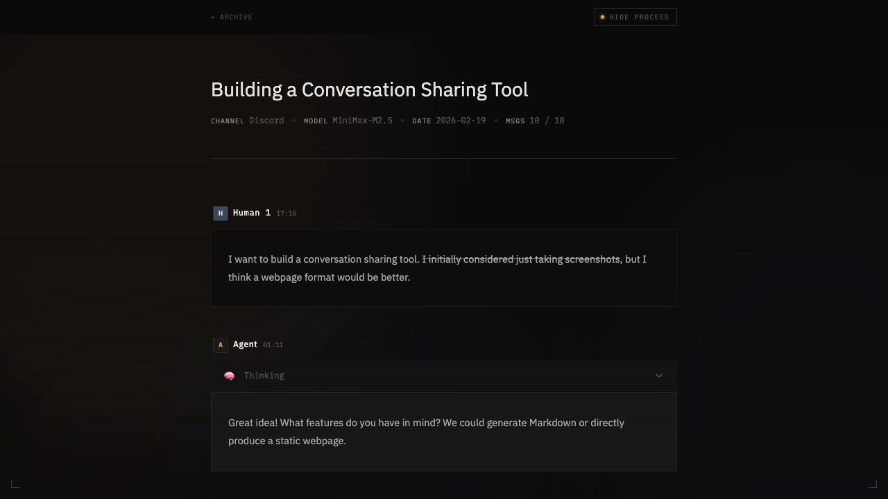

# OpenClaw Chats Share

> 📤 Escribe `/chats-share` en cualquier chat de Openclaw. Tu conversación se convierte en una página permanente en tu propia URL. Se despliega en GitHub Pages, Vercel, Netlify o Cloudflare Pages.

[English](/docs/guide/en/README.md) · [Français](/docs/guide/fr/README.md) · [中文](/docs/guide/zh/README.md) · [日本語](/docs/guide/ja/README.md) · [한국어](/docs/guide/ko/README.md)

Sin exportaciones manuales, sin copy-paste. Un comando y tu chat está en vivo en tu propia URL — título, descripción y datos sensibles gestionados para ti.

## Demo en Vivo

<a href="https://chats-share.yelo.ooo" target="_blank"></a>

## Inicio Rápido

Copia y pega esto en tu chat de agente:

```
Lee https://clawhub.ai/imyelo/chats-share e instala la habilidad chats-share,
luego ejecuta la configuración inicial para mí.
```

## Lo Que Hace el Agent Durante la Configuración

El agent creará un repositorio privado de GitHub, configurará `chats-share.toml` con tu URL de Pages, hará el commit inicial, habilitará GitHub Actions como la fuente de Pages, y registrará el proyecto para que `/chats-share` funcione inmediatamente. Para el paso a paso completo, ver [skills/chats-share/references/setup.md](../../../skills/chats-share/references/setup.md).

## Compartir un Chat

Una vez completada la configuración, usa el comando skill `/chats-share` en cualquier chat de Openclaw para exportarlo:

```
/chats-share
```

El agent va a:

1. Identificar la sesión actual a exportar
2. Pedirte que confirmes el título, descripción y visibilidad (`public` / `private`)
3. Redactar los datos sensibles que indiques
4. Escribir el archivo YAML a tu repo de trabajo en una nueva rama (`chat/{YYYYMMDD}-{slug}`)
5. Pedirte que abras un Pull Request — hacer merge a `main` dispara el build de GitHub Pages

Después de hacer merge del PR, tu chat está en vivo en `https://tu-dominio/share/{slug}`.

> **Consejo:** Establece `visibility: private` (el valor por defecto) para mantener un chat accesible solo vía enlace directo, sin que aparezca en el índice público.

## Cómo Funciona

```
/chats-share
    │
    ▼
OpenClaw Skill
    │  1. Localizar y confirmar la sesión a exportar
    │  2. Extraer el historial de mensajes
    │  3. Poblar metadatos (título, participantes, descripción)
    │  4. Redactar datos sensibles
    │  5. Escribir YAML en tu repo de datos
    │  6. Push a nueva rama → crear PR
    ▼
GitHub Pages
    └── https://tu-dominio/share/{slug}
```

### Flujo Basado en Ramas

Los chats se push a una nueva rama (`chat/{slug}`) en lugar de main, con guía para crear un PR para revisión antes de fusionar.

## Arquitectura del Repositorio

Este repo es una **plantilla pública**. Tus datos reales de chat viven en un **repo de trabajo privado** separado — esto mantiene la plantilla limpia y forkable sin contaminación de datos.

| Repo | Visibilidad | Propósito |
|------|-------------|-----------|
| `openclaw-chats-share` | Público | Plantilla, paquetes y Skill |
| `your-chats-share` | Privado | Tus datos reales de chat |

## Configuración

El paquete web se configura vía `chats-share.toml` en la raíz de tu repo de trabajo.

| Clave | Tipo | Descripción | Ejemplo |
|-------|------|-------------|---------|
| `site` | string (URL) | URL completa de tu sitio desplegado | `"https://tu-usuario.github.io"` |
| `base` | string | Ruta base para sitios de proyecto GitHub Pages | `"/mi-repo"` |
| `public_dir` | string | Directorio de assets estáticos (relativo al archivo de config) | `"public"` |
| `out_dir` | string | Directorio de salida de build (relativo al archivo de config) | `"dist"` |
| `chats_dir` | string | Ruta personalizada del directorio de chats (absoluto o relativo al config) | `"../mis-chats"` |
| `template.options.title` | string | Título de la página principal | `"chats-share"` |
| `template.options.subtitle` | string | Subtítulo de la página principal | `"// conversation archive"` |
| `template.options.description` | string | Meta descripción del sitio | `"Mi archivo de conversaciones"` |
| `template.options.footer` | string | Texto del pie de página (Markdown soportado) | `` |

**Ejemplo `chats-share.toml`:**

```toml
site = "https://tu-usuario.github.io"
base = "/tu-nombre-de-repo"

[template.options]
title = "chats-share"
subtitle = "// conversation archive"
footer = "powered by [@imyelo](https://github.com/imyelo)"
```

Al desplegar en Netlify, Vercel, Cloudflare Pages o un dominio personalizado, establece `site` con tu URL completa y omite `base`.

### Despliegue

El scaffold incluye archivos de configuración para

- ✅ GitHub Pages
- ✅ Netlify
- ✅ Vercel
- ✅ Cloudflare Pages.

Para instrucciones paso a paso, configuración de dominio personalizado y límites del nivel gratuito de cada plataforma, ver [docs/guide/es/deployment.md](/docs/guide/es/deployment.md).

## Formato de Datos

Los archivos de chat se almacenan como YAML bajo `chats/` en tu repo de trabajo. Generados por la CLI desde archivos JSONL de sesión de OpenClaw (`{id}.jsonl`).

**Nombrado de archivos:** `YYYYMMDD-{slug}.yaml`

**Campos de metadatos de nivel superior:**

| Campo | Requerido | Descripción | Ejemplo |
|-------|-----------|-------------|---------|
| `title` | Sí | Título de la sesión / nombre de exportación | `My Session` |
| `date` | Sí | Fecha de la sesión (YYYY-MM-DD) | `2026-02-15` |
| `sessionId` | Sí | ID de sesión único | `cf1f8dbe-2a12-47cf-8221-9fcbf0c47466` |
| `channel` | No | Nombre del canal/plataforma | `discord`, `telegram` |
| `model` | No | Modelo usado en la sesión | `MiniMax-M2.5` |
| `totalMessages` | No | Conteo total de mensajes | `42` |
| `totalTokens` | No | Total de tokens consumidos | `12345` |
| `tags` | No | Arreglo de etiquetas para categorización | `[coding, debug]` |
| `visibility` | No | Visibilidad del índice | `private` (por defecto) |
| `description` | No | Descripción breve para el índice | `Debugging a tricky async issue` |
| `defaultShowProcess` | No | Mostrar proceso (pensamiento, llamadas de herramientas) por defecto | `false` |
| `participants` | No | Mapea nombres de participantes a `{ role: "human" | "agent" }` | ver ejemplo |

**Visibilidad:**
- `public` — aparece en el índice de la página principal
- `private` (por defecto) — accesible solo vía URL directa, oculto del índice

La clave `timeline:` contiene una lista ordenada de objetos de mensaje y eventos. Ver el schema completo en [docs/chats-share-data-format.md](/docs/chats-share-data-format.md).

**Archivo de ejemplo:**

```yaml
title: Debugging Async Issue
date: 2026-02-15
sessionId: cf1f8dbe-2a12-47cf-8221-9fcbf0c47466
model: MiniMax-M2.5
totalMessages: 4
totalTokens: 12345
visibility: public
defaultShowProcess: false
participants:
  Alice:
    role: human
  Claude:
    role: agent

timeline:
  - type: message
    role: human
    speaker: Alice
    timestamp: "2026-02-15T06:13:50.514Z"
    content: |
      Message content...

  - type: message
    role: agent
    speaker: Claude
    timestamp: "2026-02-15T06:14:05.123Z"
    model: claude-sonnet-4-6
    content: |
      Response content...
```

## Paquetes

### `openclaw-chats-share` (CLI)

Analiza archivos JSONL crudos de OpenClaw `sessions/{uuid}.jsonl` y genera salida YAML.

```bash
npx openclaw-chats-share parse <sessions/{uuid}.jsonl> [-o output.yaml]
```

### `openclaw-chats-share-web`

Generador de sitios estáticos basado en Astro. Renderiza archivos YAML de chat en páginas compartibles.

```bash
npx openclaw-chats-share-web dev     # servidor de desarrollo local
npx openclaw-chats-share-web build   # construir sitio estático
npx openclaw-chats-share-web preview # previsualizar sitio construido localmente
```

### `create-openclaw-chats-share`

Herramienta de andamiaje para inicializar un nuevo repo de trabajo desde esta plantilla.

```bash
npx create-openclaw-chats-share <project-name>
```

## Desarrollo

```bash
# Instalar dependencias
bun install

# Iniciar servidor de desarrollo demo
bun run dev

# Construir sitio estático demo
bun run build

# Desplegar demo a GitHub Pages
bun run deploy
```

## Release

Este proyecto usa [changesets](https://github.com/changesets/changesets) para versionado y gestión de changelog.

```bash
# Crear un nuevo changeset
bun run changeset

# Ver estado de changeset
bunx changeset status

# Previsualizar bumps de versión (dry run)
bunx changeset version --dry-run

# Aplicar bumps de versión y actualizar changelogs
bun run version
```

### Flujo de Release

1. Crea un changeset antes de fusionar un PR: `bun run changeset`
2. Selecciona paquetes afectados y tipo de bump (patch/minor/major)
3. Escribe una descripción de los cambios
4. Haz commit del archivo de changeset con tu PR
5. Después de fusionar, la acción de changesets crea un PR de "Version Packages"
6. Fusionar el PR de versión desencadena npm publish

## Estructura del Proyecto

```
packages/
  cli/     - CLI de openclaw-chats-share (parser de logs de sesión + generador YAML)
  web/     - openclaw-chats-share-web (sitio estático Astro)
    src/
      components/  - MessageHeader.astro, ChatMessage.astro, CollapsibleMessage.tsx, Footer.astro, MemoryBackground.astro
      lib/         - chats.ts, config.ts, config-schema.ts
      pages/       - index.astro, share/[slug].astro
  create/  - Herramienta de andamiaje create-openclaw-chats-share
chats/     - Archivos YAML de chat de demostración
docs/      - Documentación del proyecto
skills/    - Definiciones de Skills de OpenClaw
```

## Sitios Usando openclaw-chats-share

Sitios construidos con esta herramienta:

- [Yelo](https://vibe.yelo.cc)
- Tu sitio aquí — Agrega el tuyo [enviando un PR](https://github.com/imyelo/openclaw-chats-share/edit/main/README.md)!

## Recursos Adicionales

- Ver [docs/guide/es/deployment.md](/docs/guide/es/deployment.md) para instrucciones de despliegue, configuración de dominio personalizado y límites del nivel gratuito de cada plataforma.
- Ver [docs/chats-share-data-format.md](/docs/chats-share-data-format.md) para campos frontmatter completos y formato de contenido.

## Licencia

Apache-2.0 &copy; [yelo](https://github.com/imyelo), 2026 - present
