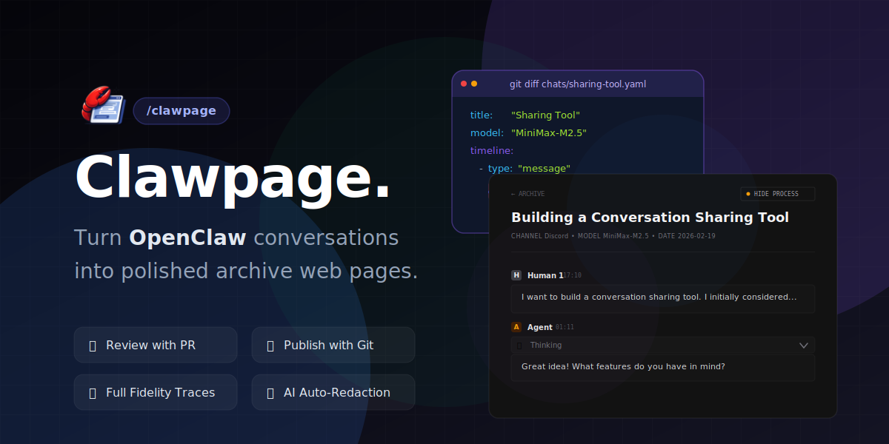

<div align="center">

# Clawpage

**모든 Openclaw 채팅에서 `/clawpage`를 입력하세요. 대화가 몇 분 만에 자신의 URL의 세련된 아카이브 페이지가 됩니다.**<br />
**🚀 GitHub Pages, Vercel, Netlify 또는 Cloudflare Pages에 배포됩니다.**



[English](/docs/guide/en/README.md) · [Español](/docs/guide/es/README.md) · [Français](/docs/guide/fr/README.md) · [中文](/docs/guide/zh/README.md) · [日本語](/docs/guide/ja/README.md)

✨ **수동 내보내기 없음, 복사-붙여넣기 없음, 민감한 데이터 자동 편집**

</div>

## 🤔 왜?

AI 채팅은 귀중하지만 사라집니다. Clawpage는 이를 저장하고 공유할 수 있는 콘텐츠로 변환합니다.

## 라이브 데모 🚀

<a href="https://clawpage.yelo.ooo/chats/building-a-conversation-sharing-tool" target="_blank"></a>

또는 저희가 직접 사용하고 있는 사이트를 확인해 보세요: [vibe.yelo.cc](https://vibe.yelo.cc)

## 📌 기능

- ⚡ **Skills 기반** — 모든 채팅에서 `/clawpage`를 입력하여 공유 시작
- 🕐 **모든 세션** — 현재 채팅뿐 아니라 ID 또는 키워드로 이전 임의의 세션도 내보내기 가능
- 🚀 **서버 관리 불필요** — 순수 정적, GitHub Pages, Vercel, Netlify 또는 Cloudflare Pages에 무료 배포
- 🔀 **게시 전 검토** — 매번 내보내기 시 PR이 생성되어 병합 전에 콘텐츠를 검토할 수 있음
- 🔒 **비공개 공유** — 직접 링크는 작동하지만 채팅은 기본적으로 공개 인덱스에 표시되지 않음
- 🛡️ **안전한 공유** — AI 지원 편집이 내보내기 전에 민감한 데이터를 `[REDACTED]`로 교체
- 🧠 **완전한 충실도** — 도구 호출 및 사고 추적이 타임라인에 보존되며 제거되지 않음

## ⚡ 빠른 시작

agent 채팅에 복사하여 붙여넣으세요:

```
https://clawhub.ai/imyelo/clawpage를 읽고 clawpage skill을 설치한 후,
첫 번째 설정을 도와주세요.
```

### 🤖 Agent가 설정 중에 하는 일

agent는 비공개 GitHub repo를 스캐폴딩하고 Pages URL로 `clawpage.toml`을 구성하고 초기 커밋을 푸시하고 GitHub Actions를 Pages 소스로 활성화하며 `/clawpage`가 즉시 작동하도록 프로젝트를 등록합니다. 전체 단계별 가이드는 [skills/clawpage/references/setup.md](../../../skills/clawpage/references/setup.md)를 참조하세요.

## 📤 채팅 공유

설정이 완료되면 Openclaw 채팅에서 `/clawpage` skill 명령을 사용하여 내보내세요:

```
/clawpage
```

agent는 다음을 수행합니다:

1. 🔍 내보낼 세션을 찾기 — 기본값은 현재 채팅; ID 또는 키워드로 이전 세션을 선택하는 것도 가능
2. ✅ 제목, 설명, 공개 설정(`public` / `private`) 확인 요청
3. 🔒 표시한 민감한 데이터 편집
4. 📝 작업 repo의 새 브랜치(`chat/{YYYYMMDD}-{slug}`)에 YAML 파일 쓰기
5. 🔀 Pull Request 열기 제안 — `main`에 병합하면 GitHub Pages 빌드 트리거

PR을 병합하면 채팅이 `https://your-domain/chats/{slug}`에 공개됩니다.

> **⚠️ 병합 전 확인:** AI 자동 편집은 100% 신뢰할 수 없습니다. PR에서 생성된 YAML 파일을 열어 누락된 민감한 내용을 `[REDACTED]`로 직접 교체하세요. 자세한 내용은 [민감한 정보 보호 방법](https://clawpage.yelo.ooo/chats/how-to-protect-sensitive-info)을 참조하세요.

> **💡 팁:** `visibility: private`(기본값)를 설정하면 채팅이 공개 인덱스에 표시되지 않고 직접 링크를 통해서만 액세스할 수 있습니다.

## ⚙️ 작동 원리

```
/clawpage
    │
    ▼
🤖 OpenClaw Skill
    │  1. 🔍 세션 찾기 (현재 또는 과거) → 확인
    │  2. 💬 메시지 기록 추출
    │  3. 📝 메타데이터 채우기 (제목, 참여자, 설명)
    │  4. 🔒 민감한 데이터 편집
    │  5. 📄 데이터 repo에 YAML 쓰기
    │  6. 🔀 새 브랜치에 푸시 → PR 생성
    ▼
🚀 GitHub Pages
    └── https://your-domain/chats/{slug}
```

### 🌿 브랜치 기반 워크플로우

채팅은 main 대신 새 브랜치(`chat/{slug}`)에 푸시되며 병합 전에 리뷰를 위해 PR을 생성하라는 안내가 표시됩니다.

## 🏗️ 저장소 아키텍처

이 저장소는 **공개 템플릿**입니다. 실제 채팅 데이터는 별도의 **비공개 작업 저장소**에 저장됩니다 — 이렇게 하면 데이터 오염 없이 템플릿을 깨끗하고 포크 가능한 상태로 유지할 수 있습니다.

| 저장소 | 공개 여부 | 목적 |
|------|------------|---------|
| `clawpage` | 공개 | 템플릿, 패키지 및 Skill |
| `your-clawpage` | 비공개 | 실제 채팅 데이터 |

## ⚡ 구성

웹 패키지는 작업 저장소 루트의 `clawpage.toml`을 통해 구성됩니다.

| 키 | 유형 | 설명 | 예시 |
|-----|------|-------------|---------|
| `site` | string (URL) | 배포된 사이트의 전체 URL | `"https://you.github.io"` |
| `base` | string | 사이트가 도메인 루트에서 제공되지 않는 경우의 기본 경로 | `"/my-repo"` |
| `public_dir` | string | 정적 에셋 디렉터리(구성 파일 기준 상대 경로) | `"public"` |
| `out_dir` | string | 빌드 출력 디렉터리(구성 파일 기준 상대 경로) | `"dist"` |
| `chats_dir` | string | 사용자 정의 채팅 디렉터리 경로(절대 또는 구성 파일 기준 상대 경로) | `"../my-chats"` |
| `template.options.title` | string |홈페이지 제목 | `"clawpage"` |
| `template.options.subtitle` | string |홈페이지 소제목 | `"// conversation archive"` |
| `template.options.description` | string | 사이트 메타 설명 | `"My conversation archive"` |
| `template.options.footer` | string | 푸터 텍스트(Markdown 지원) | `` |
| `template.options.analytics.google_analytics_id` | string | Google Analytics 4 Measurement ID | `"G-XXXXXXXXXX"` |
| `template.options.promo.enabled` | boolean | 홈페이지에 홍보 블록을 표시하여 clawpage 알리기 | `false` |

**예시 `clawpage.toml`:**

```toml
site = "https://your-username.github.io"
base = "/your-repo-name"

[template.options]
title = "clawpage"
subtitle = "// conversation archive"
footer = "powered by [@imyelo](https://github.com/imyelo)"

[template.options.promo]
enabled = true
```

Netlify, Vercel, Cloudflare Pages 또는 사용자 정의 도메인에 배포할 때는 `site`에 전체 URL을 설정하고 `base`를 생략하세요.

### 🚢 배포

scaffold에는 다음 플랫폼의 설정 파일이 포함되어 있습니다

- ✅ GitHub Pages
- ✅ Netlify
- ✅ Vercel
- ✅ Cloudflare Pages.

각 플랫폼의 단계별 지침, 사용자 정의 도메인 설정 및 무료 티어 제한은 [docs/guide/ko/deployment.md](/docs/guide/ko/deployment.md)를 참조하세요.

## 📋 데이터 형식

채팅 파일은 작업 저장소의 `chats/` 디렉터리에 YAML로 저장됩니다. CLI가 OpenClaw 세션 JSONL 파일(`{id}.jsonl`)에서 생성합니다.

**파일 명명:** `YYYYMMDD-{slug}.yaml`

**최상위 메타데이터 필드:**

| 필드 | 필수 | 설명 | 예시 |
|-------|----------|-------------|---------|
| `title` | 예 | 세션 제목 / 내보내기 이름 | `My Session` |
| `date` | 예 | 세션 날짜 (YYYY-MM-DD) | `2026-02-15` |
| `sessionId` | 예 | 고유 세션 ID | `cf1f8dbe-2a12-47cf-8221-9fcbf0c47466` |
| `channel` | 아니요 | 채널/플랫폼 이름 | `discord`, `telegram` |
| `model` | 아니요 | 세션에 사용된 모델 | `MiniMax-M2.5` |
| `totalMessages` | 아니요 | 총 메시지 수 | `42` |
| `totalTokens` | 아니요 | 소비된 총 토큰 | `12345` |
| `tags` | 아니요 | 분류용 태그 배열 | `[coding, debug]` |
| `visibility` | 아니요 | 인덱스 공개 여부 | `private` (기본값) |
| `description` | 아니요 | 인덱스 간단 설명 | `Debugging a tricky async issue` |
| `defaultShowProcess` | 아니요 | 기본적으로 프로세스(생각, 도구 호출) 표시 | `false` |
| `participants` | 아니요 | 참여자 이름을 `{ role: "human" | "agent" }`에 매핑 | 예시 참조 |

**표시 여부:**
- `public` — 홈페이지 인덱스에 표시
- `private` (기본값) — 직접 URL을 통해서만 액세스 가능, 인덱스에서는 숨김

`timeline:` 키는 메시지 및 이벤트 객체의 정렬된 목록을 담습니다. 전체 스키마는 [docs/clawpage-data-format.md](/docs/clawpage-data-format.md)를 참조하세요.

**예시 파일:**

```yaml
title: Debugging Async Issue
date: 2026-02-15
sessionId: cf1f8dbe-2a12-47cf-8221-9fcbf0c47466
model: MiniMax-M2.5
totalMessages: 4
totalTokens: 12345
visibility: public
defaultShowProcess: false
participants:
  Alice:
    role: human
  Claude:
    role: agent

timeline:
  - type: message
    role: human
    speaker: Alice
    timestamp: "2026-02-15T06:13:50.514Z"
    content: |
      Message content...

  - type: message
    role: agent
    speaker: Claude
    timestamp: "2026-02-15T06:14:05.123Z"
    model: claude-sonnet-4-6
    content: |
      Response content...
```

## 📦 패키지

### 📄 `clawpage` (CLI)

OpenClaw `sessions/{uuid}.jsonl` 원시 JSONL 파일을 파싱하고 YAML 출력을 생성합니다.

```bash
npx clawpage parse <sessions/{uuid}.jsonl> [-o output.yaml]
```

### 🌐 `clawpage-web`

Astro 기반 정적 사이트 생성기입니다. 채팅 YAML 파일을 공유 가능한 페이지로 렌더링합니다.

```bash
npx clawpage-web dev     # 로컬 개발 서버
npx clawpage-web build   # 정적 사이트 빌드
npx clawpage-web preview # 로컬에서 빌드 결과 미리보기
```

### 🛠️ `create-clawpage`

이 템플릿에서 새 작업 저장소를 초기화하는 스캐폴딩 도구입니다.

생성된 프로젝트에는 GitHub Pages, Netlify, Vercel 및 Cloudflare Pages용 배포 설정 파일이 포함되어 있습니다 — 사용하는 플랫폼을 선택하세요.

```bash
npx create-clawpage <project-name>
```

## 🧑‍💻 개발

```bash
# 의존성 설치
bun install

# 데모 개발 서버 시작
bun run dev

# 데모 정적 사이트 빌드
bun run build

# 데모를 GitHub Pages에 배포
bun run deploy
```

## 📜 릴리스

이 프로젝트는 버전 관리 및 변경 로그 관리를 위해 [changesets](https://github.com/changesets/changesets)를 사용합니다.

```bash
# 새 changeset 만들기
bun run changeset

# changeset 상태 확인
bunx changeset status

# 버전 업그레이드 미리보기 (드라이 런)
bunx changeset version --dry-run

# 버전 업그레이드 적용 및 변경 로그 업데이트
bun run version
```

### 릴리스 워크플로우

1. PR을 병합하기 전에 changeset 만들기: `bun run changeset`
2. 영향을 받는 패키지 및 버저닝 유형(patch/minor/major) 선택
3. 변경 사항 설명 작성
4. changeset 파일을 PR과 함께 커밋
5. 병합 후 changesets action이 "Version Packages" PR 생성
6. 버전 PR을 병합하면 npm publish가 트리거됩니다

## 📁 프로젝트 구조

```
packages/
  cli/     - clawpage CLI (세션 로그 파서 + YAML 생성기)
  web/     - clawpage-web (Astro 정적 사이트)
    src/
      components/  - MessageHeader.astro, ChatMessage.astro, CollapsibleMessage.tsx, Footer.astro, MemoryBackground.astro
      lib/         - chats.ts, config.ts, config-schema.ts
      pages/       - index.astro, chats/[slug].astro
  create/  - create-clawpage 스캐폴딩 도구
chats/     - 데모용 YAML 채팅 파일
docs/      - 프로젝트 문서
skills/    - OpenClaw Skill 정의
```

## 🌟 clawpage를 사용하는 사이트

이 도구로 구축된 사이트:

- [Yelo](https://vibe.yelo.cc)
- 여러분의 사이트 — [PR을 제출](https://github.com/imyelo/clawpage/edit/main/README.md)하여 추가하세요

## 📚 추가 리소스

- 각 플랫폼의 배포 지침, 사용자 정의 도메인 설정 및 무료 티어 제한은 [docs/guide/ko/deployment.md](/docs/guide/ko/deployment.md)를 참조하세요.
- 완전한 frontmatter 필드 및 콘텐츠 형식은 [docs/clawpage-data-format.md](/docs/clawpage-data-format.md)를 참조하세요.

## 라이선스

Apache-2.0 &copy; [yelo](https://github.com/imyelo), 2026 - present
